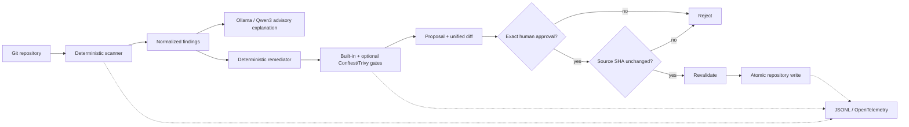

# GitOpsMedic

**A local-first CloudOps remediation agent that diagnoses Kubernetes manifest risk, proposes deterministic GitOps-style fixes, validates them, and refuses to write until a human explicitly approves the exact proposal.**

Inspired by the CloudOps pattern in the Onepoint × AWS AgentCore hackathon (Bordeaux, 29 September 2026), but deliberately implemented with a zero-cost/open-source local path.

## Why this exists

Agent demos often give an LLM broad tool access and call that automation. GitOpsMedic demonstrates a stricter platform-engineering pattern:

`READ -> DIAGNOSE -> EXPLAIN -> PROPOSE DIFF -> VALIDATE -> HUMAN APPROVAL -> APPLY`

The model is useful, but never authoritative. **Ollama can explain and prioritize findings; deterministic code owns diagnosis and remediation.**

## Architecture



## MVP features

- Kubernetes `Deployment` JSON analysis with deterministic policy rules.
- Detects weak availability, `:latest` images, missing resource bounds, root execution risk, privilege escalation and writable root filesystems.
- Generates a deterministic candidate and unified diff without touching the source.
- Uses a reviewed image annotation instead of hallucinating a replacement tag.
- Optional Conftest/Rego and Trivy validation when installed.
- Exact proposal-id human approval gate.
- SHA-256 stale-proposal protection and apply-time revalidation.
- Optional local Ollama explanation with a prompt-injection boundary.
- JSONL run telemetry; optional OTLP traces.
- Repeatable evaluation scenarios and unit tests.
- GitHub Actions CI with no marketplace checkout action.

## Quick start

Requires Python 3.11+. The core MVP has **zero mandatory Python dependencies**.

```bash
git clone <your-future-gitops-medic-url>
cd gitops-medic
make test
make eval
make demo
```

### Inspect without writing

```bash
make scan
make propose
```

`propose` prints an exact approval token, for example:

```text
proposal_id=0123456789abcdef
```

The real apply command is intentionally separate:

```bash
PYTHONPATH=src python -m gitops_medic apply .gitops-medic/proposals/0123456789abcdef.json --approve 0123456789abcdef
```

## Optional local AI

Ollama is an advisory layer only. The default model is `qwen3:4b`.

```bash
docker compose --profile ai up -d ollama
docker compose --profile ai exec ollama ollama pull qwen3:4b
make demo-llm
```

If Ollama is missing or unavailable, GitOpsMedic falls back to deterministic explanations and remains fully functional.

## Optional observability

```bash
docker compose --profile observability up -d lgtm
python -m pip install -e '.[otel]'
export OTEL_EXPORTER_OTLP_ENDPOINT=http://localhost:4318
make demo
```

Grafana LGTM is intended here for development/demo observability, not as a production architecture.

## Safety model

**READ** and **PLAN** are automatic. **APPLY** is never automatic.

Apply requires all of the following:

1. candidate passes mandatory deterministic policy validation;
2. any optional scanner that ran did not fail;
3. exact proposal id is supplied by the human;
4. target is inside the repository root;
5. source SHA-256 is unchanged;
6. candidate passes apply-time revalidation.

Raw model output is never evaluated as code and never sent to a shell.

## Evaluation

```bash
make eval
```

The included tests cover healthy/insecure states, prompt injection in repository metadata, an unfixable image version, wrong approvals, stale proposals and successful human-approved remediation.

## Devops-Tools constraint

The project was designed against the `goozcena-gnl/Devops-Tools` catalogue snapshot on 2026-09-10. External components used or proposed are drawn from that allow-list. Core implementation uses Python standard library code rather than adding an unnecessary agent framework. See `docs/research.md`.

## Portfolio roadmap

- Add YAML input after selecting an allow-listed parser/runtime strategy.
- Add read-only live Kubernetes inventory through an allow-listed MCP server.
- Generate a Git branch/PR instead of updating a working-tree file.
- Extend rules to Terraform/OpenTofu and GitOps drift.
- Add OTel metrics and dashboards for agent runs/tool errors/approval outcomes.
- Add DeepEval model-quality regression while retaining deterministic authorization.
- Add scoped identity and per-tool permissions.

## Limitations

This is a portfolio/hackathon MVP, not a production admission controller. It currently supports Kubernetes Deployment JSON, uses opinionated demo remediations, and does not claim equivalence with managed AgentCore Runtime, Identity, Memory, Gateway or Policy.

## License

MIT.
