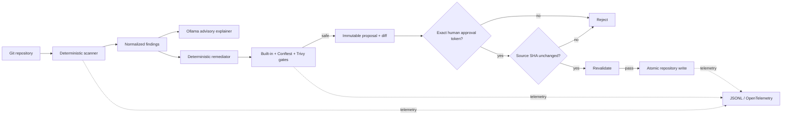

# Design

GitOpsMedic separates **facts and mutation** from **LLM advice**. The deterministic analyzer owns findings. The deterministic remediator owns candidate generation. Ollama is advisory only. Validation gates decide whether a proposal may enter the human-approval stage.

